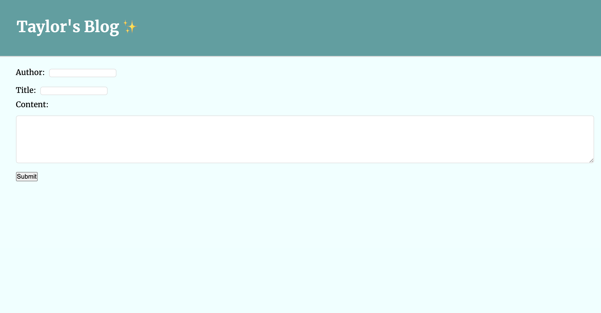
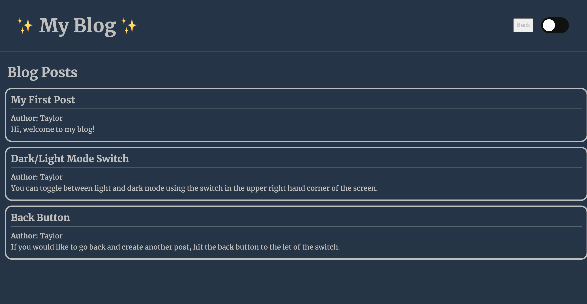

# Web APIs Challenge: Personal Blog

## Description

I created this blog as my submission for UT's Bootcamp's challenge four project. The project challenges what we have learned about Web API's over the last couple of weeks, as well as my compounding knowledge of HTML, CSS, and Javascript. On this website, users can submit forms, post data which is stored in localStorage, toggle light and dark mode, view arrays of previous blog post objects, as well as interact with the live page in a few other ways. The file structure is organized according to project specifications.

## Credit

Some example code was used to build the dark and light mode switch. The code was pulled from UT Bootcamp's Web API module, the Event Listener section. Our class TA, Walter, also assisted me in the creation of this blog.

## License

MIT

## Link to Live Site

https://tmcdaniel94.github.io/challenge4/

## Screenshot of Webpages

 